# 🔐 Práctica en clase 07 — Autenticación y Autorización

Diagramas, código y comparaciones de todos los cambios del sistema.

---

## 🎯 Objetivo de la Práctica

Implementar autenticación y autorización en la **API de Vehículos** y en la **WEB (Razor Pages)**, usando:

| Componente | Mecanismo |
|---|---|
| Contraseña almacenada | Hash SHA-256 (nunca texto claro) |
| Emisión de identidad | JWT Bearer firmado con clave simétrica (HMAC-SHA256) |
| Protección de endpoints API | `[Authorize]` / `[Authorize(Roles = "1")]` + middleware de claims |
| Sesión en la WEB | Cookie cifrada con `ClaimsPrincipal` (token dentro de los claims) |
| Comunicación WEB → API | Header `Authorization: Bearer <token>` extraído de la cookie |

### Pasos principales

1. **Crear / consumir el paquete NuGet de autorización** (`Autorizacion.Middleware`) que inyecta roles desde la BD en cada request.
2. **Agregar seguridad al API de Vehículos** — instalar paquetes JWT, registrar `AddAuthentication`, proteger controllers con `[Authorize]`.
3. **Crear la API de Seguridad** — endpoint `POST /api/autenticacion/login` que valida hash y emite el JWT.
4. **Agregar seguridad a la WEB** — registrar `AddAuthentication(Cookie)`, crear `Pages/Cuenta/` (Login, Logout, Registro, AccesoDenegado) y agregar el Bearer a todas las llamadas HTTP.

---

## Estructura del curso

| Parte | Tema | Duración |
|-------|------|----------|
| 0 | Intro — qué vamos a construir | 5 min |
| 1 | ¿Por qué necesitamos seguridad? | 8 min |
| 2 | Hash SHA256 | 8 min |
| 3 | JWT — JSON Web Token | 10 min |
| 4 | Paquete NuGet + publicación con YML | 20 min |
| 5 | API de Seguridad | 20 min |
| 6 | Publicar API de Seguridad en Azure | 10 min |
| 7 | API Vehículo con seguridad | 15 min |
| 8 | WEB Vehículo con seguridad | 20 min |
| 9 | Prueba de integración | 8 min |
| 10 | Errores frecuentes y cierre | 5 min |

---

## 📋 Tabla de contenido

- [VIDEO 1 — Conceptos 1](#video-1--conceptos-1)
  - [PARTE 0 — Intro: qué vamos a construir](#parte-0--intro-qué-vamos-a-construir)
  - [PARTE 1 — ¿Por qué necesitamos seguridad?](#parte-1--por-qué-necesitamos-seguridad)
    - [Flujo completo de autenticación](#flujo-completo-de-autenticación)
    - [Componentes del sistema](#componentes-del-sistema)
  - [PARTE 2 — Hash SHA256](#parte-2--hash-sha256)
    - [El problema sin hash](#el-problema-sin-hash)
    - [Flujo del login con hash](#flujo-del-login-con-hash)
    - [Propiedades del SHA256](#propiedades-del-sha256)
    - [Efecto avalancha](#efecto-avalancha)
    - [`Reglas/Autenticacion.cs`](#reglasautenticacioncs)
- [VIDEO 2 — Conceptos 2: JWT](#video-2--conceptos-2-jwt)
  - [PARTE 3 — JWT (JSON Web Token)](#parte-3--jwt-json-web-token)
    - [Estructura del token](#estructura-del-token)
    - [Validación del JWT en la API](#validación-del-jwt-en-la-api)
    - [401 vs 403](#401-vs-403)
- [VIDEO 3 — Middleware y Paquete NuGet](#video-3--middleware-y-paquete-nuget)
  - [✅ PRE-REQUISITOS (antes de continuar)](#pre-requisitos-antes-de-continuar)
  - [PARTE 4 — Paquete NuGet + publicación con YML](#parte-4--paquete-nuget--publicación-con-yml)
    - [Estructura del paquete](#estructura-del-paquete)
    - [Responsabilidades](#responsabilidades)
    - [`ClaimsPerfiles.cs`](#claimsperfilescs)
    - [`Autorizacion.Middleware.csproj` (estructura de los paquetes)](#autorizacionmiddlewarecsproj-estructura-de-los-paquetes)
    - [README.md](#readmemd)
    - [Publicar el paquete](#publicar-el-paquete)
    - [GitHub Actions YML — publicar paquetes](#github-actions-yml--publicar-paquetes)
    - [Configurar el feed de GitHub Packages](#configurar-el-feed-de-github-packages-una-sola-vez-por-máquina)
- [VIDEO 4 — API de Seguridad y publicación en Azure](#video-4--api-de-seguridad-y-publicación-en-azure)
  - [PARTE 5 — API de Seguridad](#parte-5--api-de-seguridad)
    - [Estructura del proyecto](#estructura-del-proyecto)
    - [Tablas en la BD de Seguridad](#tablas-en-la-bd-de-seguridad)
    - [`AutenticacionController.cs`](#autenticacioncontrollercs)
    - [Flujo del login](#flujo-del-login)
    - [`API/Program.cs` del API de Seguridad](#apiprogramcs-del-api-de-seguridad)
    - [`API/appsettings.json` del API de Seguridad](#apiappsettingsjson-del-api-de-seguridad)
  - [PARTE 6 — Publicar el API de Seguridad en Azure](#parte-6--publicar-el-api-de-seguridad-en-azure)
    - [Configuración del App Service](#configuración-del-app-service)
    - [GitHub Actions — deploy a Azure](#github-actions--deploy-a-azure)
    - [GitHub Actions — deploy BD a Azure SQL](#github-actions--deploy-bd-a-azure-sql)
    - [Variables de entorno en Azure](#variables-de-entorno-en-azure)
    - [Flujo de verificación del deploy](#flujo-de-verificación-del-deploy)
- [VIDEO 5 — API Vehículo con seguridad](#video-5--api-vehículo-con-seguridad)
  - [PARTE 7 — API Vehículo con seguridad implementada](#parte-7--api-vehículo-con-seguridad-implementada)
    - [Resumen de cambios](#resumen-de-cambios)
    - [7.1 — Feed de GitHub Packages](#71--feed-de-github-packages)
    - [7.2 — `API/API.csproj`](#72--apiapicsproj)
    - [7.3 — `Abstracciones/Modelos/Token.cs` (archivo nuevo)](#73--abstraccionesmodelostokencs-archivo-nuevo)
    - [7.4 — `API/appsettings.json`](#74--apiappsettingsjson)
    - [7.5 — `API/Program.cs`](#75--apiprogramcs)
    - [El orden del middleware es crítico](#el-orden-del-middleware-es-crítico)
    - [7.6 — Proteger los Controllers](#76--proteger-los-controllers)
- [VIDEO 6 — WEB de Vehículos con Seguridad](#video-6--web-de-vehículos-con-seguridad)
  - [PARTE 8 — WEB Vehículo con seguridad implementada](#parte-8--web-vehículo-con-seguridad-implementada)
    - [Resumen de cambios](#resumen-de-cambios-1)
    - [8.2 — `Web/Web.csproj`](#82--webwebcsproj)
    - [8.3 — Modelos de Seguridad (archivos nuevos)](#83--modelos-de-seguridad-archivos-nuevos)
    - [8.4 — Métodos de `Reglas/Autenticacion.cs` usados en el WEB](#84--métodos-de-reglasautenticacioncs-usados-en-el-web)
    - [8.5 — `Web/appsettings.json`](#85--webappsettingsjson)
    - [8.6 — `Web/Program.cs`](#86--webprogramcs)
    - [8.7 — Páginas de Seguridad](#87--páginas-de-seguridad)
      - [`Pages/Seguridad/Login.cshtml`](#pagesseguridadlogincshtml)
      - [`Pages/Seguridad/Login.cshtml.cs`](#pagesseguridadlogincshtmlcs)
      - [`Pages/Seguridad/Logout.cshtml.cs`](#pagesseguridadlogoutcshtmlcs)
    - [8.8 — Proteger páginas y agregar Bearer](#88--proteger-páginas-y-agregar-bearer)
      - [Flujo: cookie → API](#flujo-cookie--api)
      - [`Pages/Vehiculos/Index.cshtml.cs`](#pagesvehiculosindexcshtmlcs)
      - [`Pages/Vehiculos/Agregar.cshtml.cs`](#pagesvehiculosagregarcshtmlcs)
  - [PARTE 9 — Prueba de integración](#parte-9--prueba-de-integración)
    - [Secuencia de prueba](#secuencia-de-prueba)
    - [Comandos de verificación](#comandos-de-verificación)
  - [PARTE 10 — Errores frecuentes y resumen](#parte-10--errores-frecuentes-y-resumen)
    - [Errores más comunes](#errores-más-comunes)
    - [Resumen del sistema](#resumen-del-sistema)
  - [Arquitectura completa del sistema](#arquitectura-completa-del-sistema)

---

# VIDEO 1 — Conceptos 1

---

## PARTE 0 — Intro: qué vamos a construir

**ANTES (Semana 05):**
```
Navegador ──► WEB Razor ──► API Vehículo ──► BD Vehículos
             (sin login)    (sin [Authorize])
```

**DESPUÉS (Semana 06):**
```
Navegador ──► WEB Razor ──► API Vehículo ──► BD Vehículos
             Login/Cookie    [Authorize]
                 │
                 ▼
          API Seguridad ──► BD Seguridad
          (emite JWT)       (usuarios + roles)
```

---

## PARTE 1 — ¿Por qué necesitamos seguridad?

### Flujo completo de autenticación

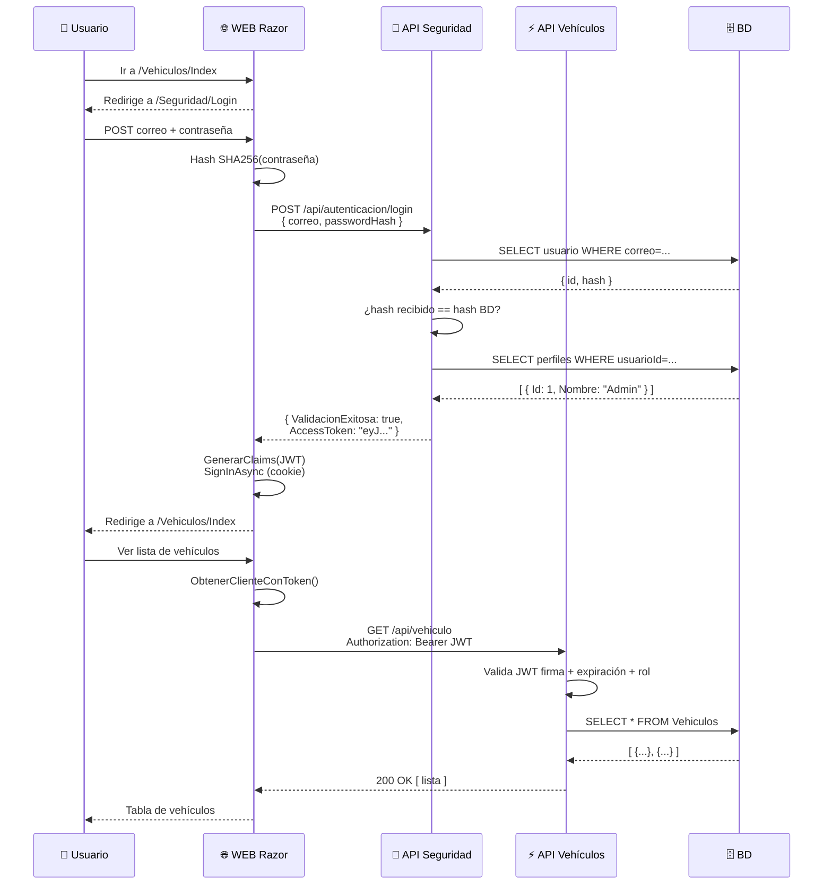

### Componentes del sistema

1. **Hash SHA256** — protege la contraseña antes de enviarla y guardarla
2. **API de Seguridad** — el único componente que valida credenciales y emite tokens
3. **JWT** — token que identifica al usuario y sus roles
4. **Middleware de autorización** — consulta roles en BD y los agrega al contexto
5. **Cookie Auth** — el WEB guarda el JWT dentro de una cookie cifrada

---

## PARTE 2 — Hash SHA256

### El problema sin hash

**❌ Sin hash:**
```
BD Usuarios: { NombreUsuario: "juan", Password: "MiContraseña123" }
```

**✅ Con hash:**
```
BD Usuarios: { NombreUsuario: "juan", PasswordHash: "a7b9c2d...f3e1" }
```

### Flujo del login con hash

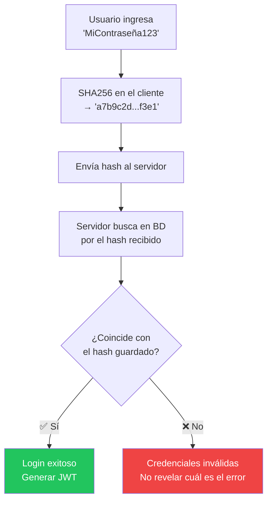

### Propiedades del SHA256

| Propiedad | Descripción |
|-----------|-------------|
| **Determinista** | La misma entrada siempre produce la misma salida |
| **Irreversible** | No se puede calcular el texto original a partir del hash |
| **Efecto avalancha** | Un cambio mínimo produce un hash completamente diferente |
| **Longitud fija** | Siempre devuelve 64 caracteres hexadecimales |

### Efecto avalancha

```
SHA256("MiContraseña123")  = a7b9c2d8e4f1a3b5c7d9e2f4a6b8c1d3...
SHA256("miContraseña123")  = f3e2d1c0b9a8f7e6d5c4b3a2f1e0d9c8...
                             ████ completamente diferente ████
```

### `Reglas/Autenticacion.cs`

```csharp
using System.Security.Claims;
using System.Security.Cryptography;
using System.IdentityModel.Tokens.Jwt;
using System.Text;

namespace Reglas
{
    public static class Autenticacion
    {
        // Genera el hash SHA256 de una cadena de texto
        public static string GenerarHash(string texto)
        {
            using var sha256 = SHA256.Create();
            var bytes = sha256.ComputeHash(Encoding.UTF8.GetBytes(texto));
            return BitConverter.ToString(bytes).Replace("-", "").ToLower();
        }

        // Lee un JWT y retorna el valor de un claim específico
        public static string ObtenerHash(string token, string claimType)
        {
            var handler = new JwtSecurityTokenHandler();
            var jwtToken = handler.ReadJwtToken(token);
            return jwtToken.Claims
                           .FirstOrDefault(c => c.Type == claimType)?.Value ?? string.Empty;
        }

        // Convierte el JWT en un ClaimsIdentity (para la cookie de sesión del WEB)
        public static ClaimsIdentity GenerarClaims(string token)
        {
            var handler    = new JwtSecurityTokenHandler();
            var jwtToken   = handler.ReadJwtToken(token);
            var claims     = jwtToken.Claims.ToList();

            // Agregar el token completo como claim para enviarlo después al API
            claims.Add(new Claim("AccessToken", token));

            return new ClaimsIdentity(
                claims,
                Microsoft.AspNetCore.Authentication.Cookies
                          .CookieAuthenticationDefaults.AuthenticationScheme);
        }

        // Lee directamente el JWT sin desencriptar (Base64)
        public static string leerToken(string token)
        {
            var handler  = new JwtSecurityTokenHandler();
            var jwtToken = handler.ReadJwtToken(token);
            return jwtToken.ToString();
        }
    }
}
```

---

# VIDEO 2 — Conceptos 2: JWT

---

## PARTE 3 — JWT (JSON Web Token)

### Estructura del token

```
eyJhbGciOiJIUzI1NiIsInR5cCI6IkpXVCJ9
.
eyJzdWIiOiIxMjM0NTY3ODkwIiwibmFtZSI6Ikp1YW4iLCJyb2xlIjoiMSJ9
.
SflKxwRJSMeKKF2QT4fwpMeJf36POk6yJV_adQssw5c
```

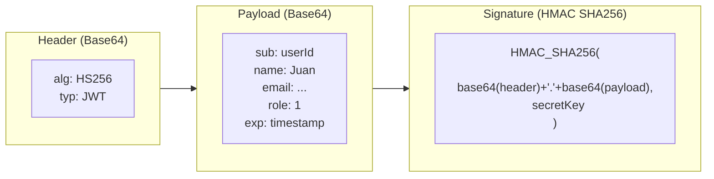

> ⚠️ El payload es Base64, **no** cifrado. JWT garantiza **integridad** (no fue modificado),
> no confidencialidad. No guardar contraseñas en el payload.

### Validación del JWT en la API

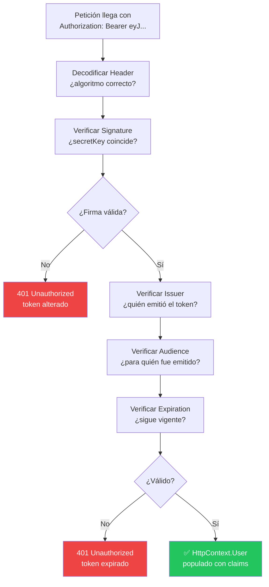

### 401 vs 403

| Código | Significado | Causa |
|--------|-------------|-------|
| `401 Unauthorized` | Sin identidad válida | No hay token, está expirado o mal formado |
| `403 Forbidden` | Identidad válida, sin permiso | Token válido pero el rol no tiene acceso |

---


# VIDEO 3 — Middleware y Paquete NuGet
---

## ✅ PRE-REQUISITOS (antes de continuar)


- [ ] **API y WEB Razor funcionales sin autenticación ni autorización** — el punto de partida es el código de la Semana 05: la API de Vehículos responde sin token y el WEB no tiene login
- [ ] **Acceso al repositorio del curso** — necesitan permisos de lectura sobre el repositorio donde está el código base (`SC-701/2026C01` o el que el profesor indique)
- [ ] **Clonar el repositorio del curso** — tener el código descargado localmente y abierto en el IDE
  ```bash
  git clone https://github.com/SC-701/2026C01.git
  cd 2026C01
  ```
- [ ] **Acceso al repositorio de la práctica** — el repositorio personal donde van a subir su solución; deben tener permisos de escritura para que GitHub Actions pueda publicar el paquete NuGet
- [ ] **Azure disponible para crear Web Apps** — una cuenta de Azure activa (suscripción de pago o créditos de Azure for Students) con permisos para crear App Services

> ⚠️ Si no tienen Azure disponible, pueden seguir las Partes 4 y 5 completas en local. Solo la Parte 6 (deploy) requiere Azure. Las Partes 7 y 8 pueden apuntar al API de Seguridad corriendo en `localhost` cambiando la URL en `appsettings.json`.

---

## PARTE 4 — Paquete NuGet + publicación con YML

### Estructura del paquete

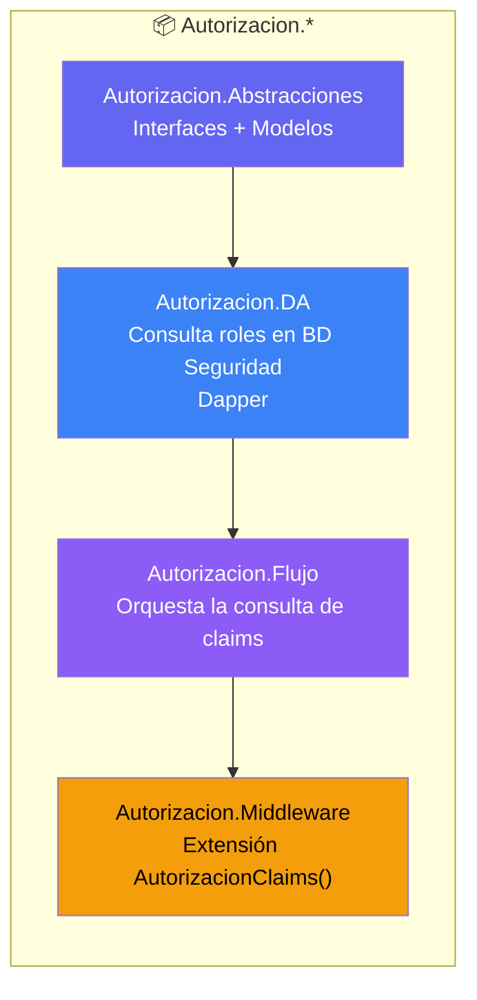

### Responsabilidades

| Proyecto | Qué hace |
|----------|----------|
| `Autorizacion.Abstracciones` | Define `ISeguridadDA`, `IAutorizacionFlujo`, modelo `Perfil` |
| `Autorizacion.DA` | Ejecuta `SELECT Perfiles WHERE UsuarioId = @id` usando Dapper |
| `Autorizacion.Flujo` | Agrega los claims de rol al `HttpContext.User` |
| `Autorizacion.Middleware` | Expone el método de extensión `app.AutorizacionClaims()` |

### `ClaimsPerfiles.cs`

```csharp
// Autorizacion.Middleware/ClaimsPerfiles.cs
namespace Autorizacion.Middleware
{
    public class ClaimsPerfiles
    {
        private readonly RequestDelegate _next;
        private readonly IConfiguration _configuration;
        private IAutorizacionFlujo _autorizacionFlujo;

        public ClaimsPerfiles(RequestDelegate next, IConfiguration configuration)
        {
            _next = next;
            _configuration = configuration;
        }

        public async Task InvokeAsync(HttpContext httpContext, IAutorizacionFlujo autorizacionFlujo)
        {
            _autorizacionFlujo = autorizacionFlujo;
            ClaimsIdentity appIdentity = await verificarAutorizacion(httpContext);
            httpContext.User.AddIdentity(appIdentity);
            await _next(httpContext);
        }

        private async Task<ClaimsIdentity> verificarAutorizacion(HttpContext httpContext)
        {
            var claims = new List<Claim>();
            if (httpContext.User != null && httpContext.User.Identity.IsAuthenticated)
                await ObtenerPerfiles(httpContext, claims);
            return new ClaimsIdentity(claims);
        }

        private async Task ObtenerPerfiles(HttpContext httpContext, List<Claim> claims)
        {
            var perfiles = await obtenerInformacionPerfiles(httpContext);
            if (perfiles != null && perfiles.Any())
                foreach (var perfil in perfiles)
                    claims.Add(new Claim(ClaimTypes.Role, perfil.Id.ToString()));
        }

        private async Task<IEnumerable<Perfil>> obtenerInformacionPerfiles(HttpContext httpContext)
        {
            return await _autorizacionFlujo.ObtenerPerfilesxUsuario(
                new Usuario {
                    NombreUsuario = httpContext.User.Claims
                        .Where(c => c.Type == ClaimTypes.Name)
                        .FirstOrDefault().Value
                });
        }
    }

    public static class ClaimsUsuarioMiddlewareExtensions
    {
        public static IApplicationBuilder AutorizacionClaims(this IApplicationBuilder builder)
        {
            return builder.UseMiddleware<ClaimsPerfiles>();
        }
    }
}
```

### `Autorizacion.Middleware.csproj` (estructura de los paquetes)

```xml
<Project Sdk="Microsoft.NET.Sdk">
  <PropertyGroup>
    <TargetFramework>net8.0</TargetFramework>
    <Nullable>enable</Nullable>
    <ImplicitUsings>enable</ImplicitUsings>
    <!-- ★ Metadatos del paquete NuGet -->
    <Version>1.0.0</Version>
    <PackageId>Autorizacion.Middleware.drojas</PackageId>
    <Authors>Drojascode</Authors>
    <Description>Middleware de autorización por claims para ASP.NET Core 8</Description>
    <RepositoryUrl>https://github.com/Drojascode/SC701</RepositoryUrl>
    <PackageReadmeFile>README.md</PackageReadmeFile>
  </PropertyGroup>

  <ItemGroup>
    <PackageReference Include="Microsoft.AspNetCore.Http.Abstractions" Version="2.1.1" />
    <PackageReference Include="Microsoft.Extensions.Configuration.Abstractions" Version="2.1.1" />
  </ItemGroup>

  <ItemGroup>
    <ProjectReference Include="..\Autorizacion.Abstracciones\Autorizacion.Abstracciones.csproj" />
  </ItemGroup>

  <ItemGroup>
    <None Include="..\..\..\README.md" Pack="true" PackagePath="\" />
  </ItemGroup>
</Project>
```

**`Autorizacion.Abstracciones.csproj`**

```xml
<Project Sdk="Microsoft.NET.Sdk">
  <PropertyGroup>
    <TargetFramework>net8.0</TargetFramework>
    <Nullable>enable</Nullable>
    <ImplicitUsings>enable</ImplicitUsings>
    <Version>1.0.0</Version>
    <PackageId>Autorizacion.Abstracciones.drojas</PackageId>
    <Authors>Drojascode</Authors>
    <Description>Interfaces y modelos del paquete de autorización por claims para ASP.NET Core 8</Description>
    <RepositoryUrl>https://github.com/Drojascode/SC701</RepositoryUrl>
    <PackageReadmeFile>README.md</PackageReadmeFile>
  </PropertyGroup>

  <ItemGroup>
    <None Include="..\..\..\README.md" Pack="true" PackagePath="\" />
  </ItemGroup>
</Project>
```

**`Autorizacion.DA.csproj`**

```xml
<Project Sdk="Microsoft.NET.Sdk">
  <PropertyGroup>
    <TargetFramework>net8.0</TargetFramework>
    <Nullable>enable</Nullable>
    <ImplicitUsings>enable</ImplicitUsings>
    <Version>1.0.0</Version>
    <PackageId>Autorizacion.DA.drojas</PackageId>
    <Authors>Drojascode</Authors>
    <Description>Capa de acceso a datos del paquete de autorización. Consulta perfiles de usuario en la BD de seguridad con Dapper</Description>
    <RepositoryUrl>https://github.com/Drojascode/SC701</RepositoryUrl>
    <PackageReadmeFile>README.md</PackageReadmeFile>
  </PropertyGroup>

  <ItemGroup>
    <PackageReference Include="Dapper" Version="2.1.35" />
    <PackageReference Include="Microsoft.Extensions.Configuration.Abstractions" Version="2.1.1" />
  </ItemGroup>

  <ItemGroup>
    <ProjectReference Include="..\Autorizacion.Abstracciones\Autorizacion.Abstracciones.csproj" />
  </ItemGroup>

  <ItemGroup>
    <None Include="..\..\..\README.md" Pack="true" PackagePath="\" />
  </ItemGroup>
</Project>
```

**`Autorizacion.Flujo.csproj`** *(carpeta del repo: `Abstracciones.BW/`)*

```xml
<Project Sdk="Microsoft.NET.Sdk">
  <PropertyGroup>
    <TargetFramework>net8.0</TargetFramework>
    <Nullable>enable</Nullable>
    <ImplicitUsings>enable</ImplicitUsings>
    <Version>1.0.0</Version>
    <PackageId>Autorizacion.Flujo.drojas</PackageId>
    <Authors>Drojascode</Authors>
    <Description>Lógica de negocio del paquete de autorización. Agrega perfiles del usuario como claims al ClaimsPrincipal</Description>
    <RepositoryUrl>https://github.com/Drojascode/SC701</RepositoryUrl>
    <PackageReadmeFile>README.md</PackageReadmeFile>
  </PropertyGroup>

  <ItemGroup>
    <ProjectReference Include="..\Autorizacion.Abstracciones\Autorizacion.Abstracciones.csproj" />
  </ItemGroup>

  <ItemGroup>
    <None Include="..\..\..\README.md" Pack="true" PackagePath="\" />
  </ItemGroup>
</Project>
```

### README.md

> Solo se necesita el `README.md` en la **raíz del repositorio**. NuGet lo toma automáticamente — no es necesario un README por cada proyecto interno.

```bash
# Instalar el paquete desde GitHub Packages
dotnet add package Autorizacion.Middleware.drojas --version 1.0.0
```

### Publicar el paquete

```bash
# Desde la carpeta del proyecto
dotnet pack --configuration Release
```

### GitHub Actions YML — publicar paquetes

```yaml
name: Publicar paquetes NuGet de Autorización

on:
  push:
    branches: [ "main" ]
    paths:
      - 'Seguridad/Seguridad.MiddlewareAutorizacion/**'
  workflow_dispatch:

permissions:
  contents: read
  packages: write

jobs:
  publish:
    runs-on: ubuntu-latest

    steps:
      - uses: actions/checkout@v4

      - name: Setup .NET 8
        uses: actions/setup-dotnet@v4
        with:
          dotnet-version: '8.0'

      - name: Restaurar dependencias
        run: |
          cd "Seguridad/Seguridad.MiddlewareAutorizacion"
          dotnet restore

      - name: Compilar en Release
        run: |
          cd "Seguridad/Seguridad.MiddlewareAutorizacion"
          dotnet build --configuration Release --no-restore

      - name: Cleanup old .nupkg files
        run: |
          rm -f Seguridad/Seguridad.MiddlewareAutorizacion/nupkgs/*.nupkg

      - name: Empaquetar (dotnet pack)
        run: |
          cd "Seguridad/Seguridad.MiddlewareAutorizacion"
          dotnet pack --configuration Release --no-build --output ./nupkgs

      - name: Set up NuGet sources
        run: dotnet nuget add source "https://nuget.pkg.github.com/SC-701/index.json" --name "github" --username ${{ github.actor }} --password ${{ secrets.GITHUB_TOKEN }} --store-password-in-clear-text

      - name: Publicar en GitHub Packages
        run: |
          cd "Seguridad/Seguridad.MiddlewareAutorizacion"
          dotnet nuget push ./nupkgs/*.nupkg \
            --source "https://nuget.pkg.github.com/SC-701/index.json" \
            --api-key ${{ secrets.GITHUB_TOKEN }} \
            --skip-duplicate
```

**Cómo funciona:**
- `push: paths:` → solo se dispara cuando cambia código dentro de la solución del paquete
- `secrets.GITHUB_TOKEN` → token automático que GitHub inyecta en cada workflow (no hay que configurarlo)
- `--skip-duplicate` → si la versión ya existe en GitHub Packages, no falla — simplemente la omite

**Para disparar el workflow — hacer commit y push:**
```bash
# 1. Ver qué archivos cambiaron
git status

# 2. Agregar todos los cambios al staging
git add .

# 3. Hacer el commit con un mensaje descriptivo
git commit -m "feat: agregar middleware de autorización NuGet"

# 4. Subir los cambios a GitHub (dispara el workflow automáticamente)
git push origin main
```

### Configurar el feed de GitHub Packages (una sola vez por máquina)

**1. Crear un PAT** en GitHub → Settings → Developer settings → Personal access tokens → Tokens (classic)
Scope requerido: ✅ `read:packages`

**2. Registrar el feed:**

```powershell
dotnet nuget add source https://nuget.pkg.github.com/SC-701/index.json `
  --name github `
  --username TU_USUARIO_GITHUB `
  --password TU_PERSONAL_ACCESS_TOKEN `
  --store-password-in-clear-text
```

> ✅ Credenciales en NuGet global del usuario — **nunca en el proyecto**

---

# VIDEO 4 — API de Seguridad y publicación en Azure

---

## PARTE 5 — API de Seguridad

### Estructura del proyecto

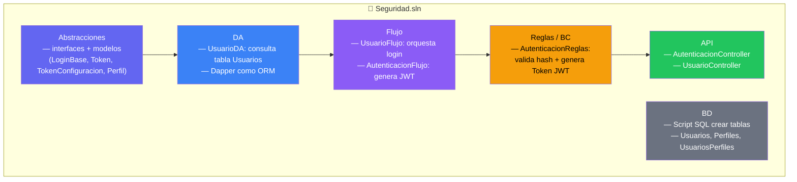

### Tablas en la BD de Seguridad

| Tabla | Columnas clave | Descripción |
|-------|---------------|-------------|
| `Usuarios` | `Id`, `NombreUsuario`, `CorreoElectronico`, `PasswordHash` | Credenciales de acceso |
| `Perfiles` | `Id`, `Nombre` | Roles (ej: Id=1 → "Administrador") |
| `UsuariosPerfiles` | `UsuarioId`, `PerfilId` | Asignación de roles a usuarios |

### `AutenticacionController.cs`

```csharp
[Authorize]
[Route("api/[controller]")]
[ApiController]
public class AutenticacionController : ControllerBase, IAutenticacionController
{
    private IAutenticacionFlujo _autenticacionFlujo;

    public AutenticacionController(IAutenticacionFlujo autenticacionFlujo)
    {
        _autenticacionFlujo = autenticacionFlujo;
    }

    [AllowAnonymous]          // ★ este endpoint no requiere token — es el login
    [HttpPost("login")]
    public async Task<IActionResult> PostAsync([FromBody] LoginBase login)
    {
        // Recibe: { NombreUsuario, PasswordHash, CorreoElectronico }
        // Retorna: { ValidacionExitosa: true/false, AccessToken: "eyJ..." }
        return Ok(await _autenticacionFlujo.LoginAsync(login));
    }
}
```

> El endpoint es `POST /api/autenticacion/login` y es `[AllowAnonymous]` — no necesita token.
> Todo lo demás en el API (si hubiera otros endpoints) sí requiere `[Authorize]`.

### Flujo del login

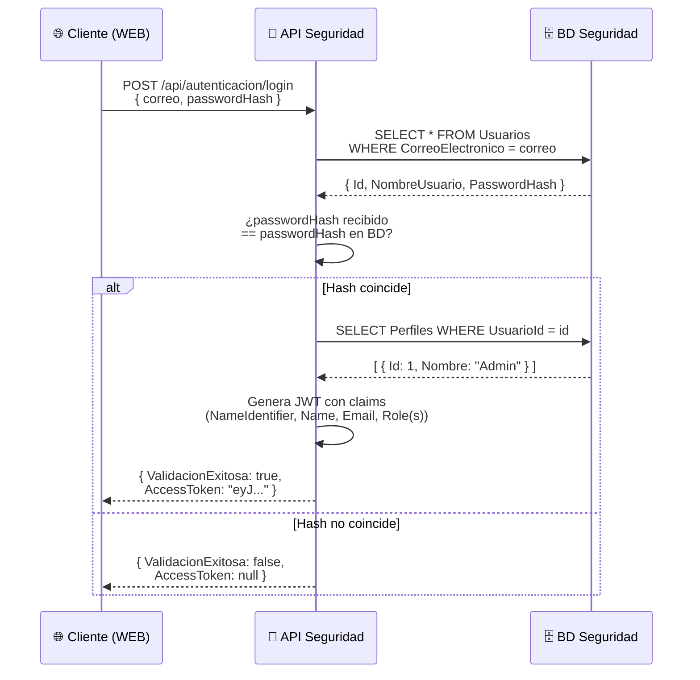

### `API/Program.cs` del API de Seguridad

```csharp
var builder = WebApplication.CreateBuilder(args);

// ★ Leer configuración JWT
var tokenConfiguration = builder.Configuration
    .GetSection("Token").Get<TokenConfiguracion>();

// ★ Registrar JWT Bearer (para proteger los demás endpoints del API de seg.)
builder.Services.AddAuthentication(JwtBearerDefaults.AuthenticationScheme)
    .AddJwtBearer(options => {
        options.TokenValidationParameters = new TokenValidationParameters
        {
            ValidateIssuer           = true,
            ValidateAudience         = true,
            ValidateLifetime         = true,
            ValidateIssuerSigningKey = true,
            ValidIssuer              = tokenConfiguration.Issuer,
            ValidAudience            = tokenConfiguration.Audience,
            IssuerSigningKey         = new SymmetricSecurityKey(
                                           Encoding.UTF8.GetBytes(tokenConfiguration.key))
        };
    });

builder.Services.AddControllers();
builder.Services.AddEndpointsApiExplorer();
builder.Services.AddSwaggerGen();

// Servicios propios de seguridad
builder.Services.AddScoped<IRepositorioDapper, RepositorioDapper>();
builder.Services.AddScoped<IUsuarioDA, UsuarioDA>();
builder.Services.AddScoped<IUsuarioFlujo, UsuarioFlujo>();
builder.Services.AddScoped<IAutenticacionFlujo, AutenticacionFlujo>();
builder.Services.AddScoped<IAutenticacionBC, AutenticacionReglas>();

// ★ Servicios del paquete NuGet de autorización
builder.Services.AddTransient<Autorizacion.Abstracciones.Flujo.IAutorizacionFlujo,
                               Autorizacion.Flujo.AutorizacionFlujo>();
builder.Services.AddTransient<Autorizacion.Abstracciones.DA.ISeguridadDA,
                               Autorizacion.DA.SeguridadDA>();
builder.Services.AddTransient<Autorizacion.Abstracciones.DA.IRepositorioDapper,
                               Autorizacion.DA.Repositorios.RepositorioDapper>();

var app = builder.Build();

if (app.Environment.IsDevelopment())
{
    app.UseSwagger();
    app.UseSwaggerUI();
}

app.UseHttpsRedirection();
app.AutorizacionClaims();   // ★ del paquete NuGet que acabamos de crear
app.UseAuthorization();
app.MapControllers();
app.Run();
```

### `API/appsettings.json` del API de Seguridad

```json
{
  "Logging": {
    "LogLevel": { "Default": "Information", "Microsoft.AspNetCore": "Warning" }
  },
  "AllowedHosts": "*",
  "ConnectionStrings": {
    "BD": "Data Source=.;Initial Catalog=seguridad;Integrated Security=True;Trust Server Certificate=True"
  },
  "Token": {
    "key":      "Textoparagenerarelotkenjwtdelapi",
    "Issuer":   "localhost",
    "Audience": "localhost",
    "Expires":  "120"
  }
}
```

> ⚠️ La misma `key` DEBE usarse en el API Vehículo (Parte 7). Si no coinciden, el token generado
> aquí no podrá ser validado allá.

---

## PARTE 6 — Publicar el API de Seguridad en Azure

### Configuración del App Service

| Campo | Valor |
|-------|-------|
| Nombre | `seguridad-api-sc701` (debe ser único globalmente) |
| Runtime stack | `.NET 8 (LTS)` |
| Sistema operativo | `Linux` (más económico) |
| Plan | `Free F1` (para desarrollo/demo) |
| Región | `East US` o el más cercano |

### GitHub Actions — deploy a Azure

```yaml
name: Deploy Seguridad API to Azure

env:
  AZURE_WEBAPP_NAME:         seguridad-api-sc701
  AZURE_WEBAPP_PACKAGE_PATH: './Ejemplos/Seguridad/Seguridad.API/API'
  DOTNET_VERSION:            '8.0'

on:
  push:
    branches: [ "main" ]
    paths:
      - 'Ejemplos/Seguridad/Seguridad.API/**'
  workflow_dispatch:

permissions:
  contents: read

jobs:
  build-and-deploy:
    runs-on: ubuntu-latest

    steps:
      - uses: actions/checkout@v4

      - name: Setup .NET 8
        uses: actions/setup-dotnet@v4
        with:
          dotnet-version: ${{ env.DOTNET_VERSION }}

      - name: Configurar NuGet feed privado
        run: |
          dotnet nuget add source \
            "https://nuget.pkg.github.com/SC-701/index.json" \
            --name "Paquetes" \
            --username "${{ github.actor }}" \
            --password "${{ secrets.GITHUB_TOKEN }}" \
            --store-password-in-clear-text

      - name: Restaurar dependencias
        run: |
          cd "Ejemplos/Seguridad/Seguridad.API"
          dotnet restore "Abstracciones/Abstracciones.csproj"
          dotnet restore "DA/DA.csproj"
          dotnet restore "Flujo/Flujo.csproj"
          dotnet restore "Reglas/Reglas.csproj"
          dotnet restore "API/API.csproj"

      - name: Compilar
        run: |
          cd "Ejemplos/Seguridad/Seguridad.API"
          dotnet build "API/API.csproj" --configuration Release --no-restore

      - name: Publicar (dotnet publish)
        run: |
          cd "Ejemplos/Seguridad/Seguridad.API"
          dotnet publish "API/API.csproj" \
            --configuration Release \
            --no-build \
            --output ./publish

      - name: Deploy a Azure Web App
        uses: azure/webapps-deploy@v3
        with:
          app-name:        ${{ env.AZURE_WEBAPP_NAME }}
          publish-profile: ${{ secrets.AZURE_WEBAPP_PUBLISH_PROFILE_SEGURIDAD }}
          package:         './Ejemplos/Seguridad/Seguridad.API/publish'
```

> ⚠️ Necesitarás agregar el secret `NUGET_TOKEN` con un Personal Access Token de GitHub
> que tenga permisos `read:packages` para descargar los paquetes NuGet custom.

### GitHub Actions — deploy BD a Azure SQL

```yaml
name: Deploy Seguridad Database to Azure SQL

env:
  AZURE_SQL_SERVER: darvsc701.database.windows.net
  AZURE_SQL_DATABASE: Vehiculos
  DACPAC_PATH: 'Seguridad/Seguridad.API/BD/bin/Release/BD.dacpac'

on:
  push:
    branches: [ "main" ]
    paths:
      - 'Seguridad/Seguridad.API/BD/**'
  workflow_dispatch:

permissions:
  contents: read
  packages: read

jobs:
  build-and-deploy-database:
    runs-on: windows-latest
    environment:
      name: 'Production-Database'

    steps:
      - uses: actions/checkout@v4

      - name: Setup MSBuild
        uses: microsoft/setup-msbuild@v2

      - name: Setup NuGet
        uses: NuGet/setup-nuget@v1

      - name: Create NuGet.Config with GitHub Packages credentials
        run: |
          $content = @"
          <?xml version="1.0" encoding="utf-8"?>
          <configuration>
            <packageSources>
              <add key="github" value="https://nuget.pkg.github.com/SC-701/index.json" />
            </packageSources>
            <packageSourceCredentials>
              <github>
                <add key="Username" value="${{ github.actor }}" />
                <add key="ClearTextPassword" value="${{ secrets.GITHUB_TOKEN }}" />
              </github>
            </packageSourceCredentials>
          </configuration>
          "@
          $content | Out-File -FilePath "Seguridad/Seguridad.API/NuGet.Config" -Encoding utf8
        shell: powershell

      - name: Restore NuGet packages
        run: nuget restore "Seguridad/Seguridad.API/Seguridad.sln"

      - name: Build Database Project
        run: |
          msbuild "Seguridad/Seguridad.API/BD/BD.sqlproj" /p:Configuration=Release /p:Platform="Any CPU" /p:OutputPath="./bin/Release/"
        shell: cmd

      - name: Verify DACPAC file exists
        run: |
          if (Test-Path "${{ env.DACPAC_PATH }}") {
            Write-Host "DACPAC file found at ${{ env.DACPAC_PATH }}"
            Get-Item "${{ env.DACPAC_PATH }}" | Format-List
          } else {
            Write-Error "DACPAC file not found at ${{ env.DACPAC_PATH }}"
            exit 1
          }
        shell: powershell

      - name: Deploy to Azure SQL Database
        uses: azure/sql-action@v2
        with:
          connection-string: ${{ secrets.AZURE_SQL_CONNECTION_STRING }}
          path: ${{ env.DACPAC_PATH }}
          action: 'publish'
          arguments: '/p:DropObjectsNotInSource=false /p:BlockOnPossibleDataLoss=true /p:IgnoreRoleMembership=true'

      - name: Database Deployment Summary
        run: |
          Write-Host "Database deployment completed successfully!"
          Write-Host "Target Server: ${{ env.AZURE_SQL_SERVER }}"
          Write-Host "Target Database: ${{ env.AZURE_SQL_DATABASE }}"
        shell: powershell
```

> Corre en `windows-latest` porque MSBuild para `.sqlproj` solo funciona en Windows.
> Requiere el secret `AZURE_SQL_CONNECTION_STRING` con la cadena de conexión a Azure SQL.
> Se dispara únicamente cuando hay cambios dentro de `Seguridad/Seguridad.API/BD/**`.

### Variables de entorno en Azure

| Nombre | Valor |
|--------|-------|
| `ConnectionStrings__BD` | Cadena de conexión a Azure SQL |
| `Token__key` | Clave secreta JWT (32+ caracteres) |
| `Token__Issuer` | FQDN del App Service: `seguridad-api-sc701.azurewebsites.net` |
| `Token__Audience` | FQDN del App Service o `*` |
| `Token__Expires` | `120` |

> El doble guion bajo `__` es la forma que usa .NET para mapear la jerarquía de `appsettings.json`
> desde variables de entorno. `ConnectionStrings__BD` = `ConnectionStrings:BD`.

### Flujo de verificación del deploy

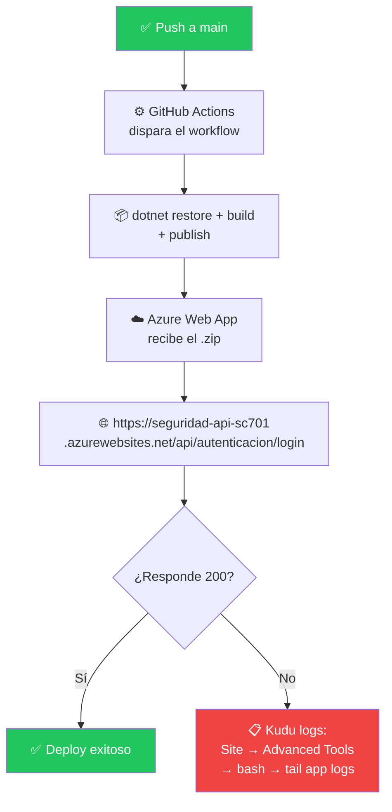

---

---

# VIDEO 5 — API Vehículo con seguridad

---

## PARTE 7 — API Vehículo con seguridad implementada

### Resumen de cambios

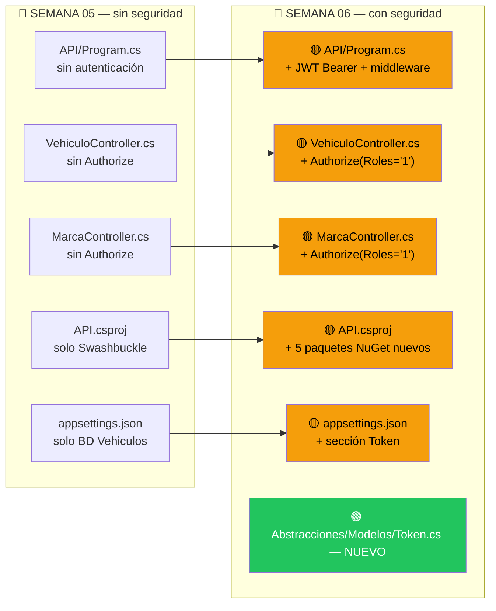

### 7.1 — Feed de GitHub Packages

> Si ya ejecutaste el comando en la PARTE 4, el feed está listo. Si es una máquina nueva:

```powershell
dotnet nuget add source https://nuget.pkg.github.com/SC-701/index.json `
  --name github `
  --username TU_USUARIO_GITHUB `
  --password TU_PERSONAL_ACCESS_TOKEN `
  --store-password-in-clear-text
```

### 7.2 — `API/API.csproj`

**ANTES:**
```xml
<Project Sdk="Microsoft.NET.Sdk.Web">
  <PropertyGroup>
    <TargetFramework>net8.0</TargetFramework>
    <Nullable>enable</Nullable>
    <ImplicitUsings>enable</ImplicitUsings>
  </PropertyGroup>

  <ItemGroup>
    <PackageReference Include="Swashbuckle.AspNetCore" Version="6.6.2" />
  </ItemGroup>

  <ItemGroup>
    <ProjectReference Include="..\Abstracciones\Abstracciones.csproj" />
    <ProjectReference Include="..\DA\DA.csproj" />
    <ProjectReference Include="..\Flujo\Flujo.csproj" />
    <ProjectReference Include="..\Reglas\Reglas.csproj" />
    <ProjectReference Include="..\Servicios\Servicios.csproj" />
  </ItemGroup>
</Project>
```

**DESPUÉS:**
```xml
<Project Sdk="Microsoft.NET.Sdk.Web">
  <PropertyGroup>
    <TargetFramework>net8.0</TargetFramework>
    <Nullable>enable</Nullable>
    <ImplicitUsings>enable</ImplicitUsings>
  </PropertyGroup>

  <ItemGroup>
    <PackageReference Include="Swashbuckle.AspNetCore" Version="6.6.2" />
    <!-- ★ NUEVOS -->
    <PackageReference Include="Autorizacion.Abstracciones" Version="2.0.6" />
    <PackageReference Include="Autorizacion.DA"            Version="2.0.6" />
    <PackageReference Include="Autorizacion.Flujo"         Version="2.0.6" />
    <PackageReference Include="Autorizacion.Middleware"    Version="2.0.6" />
    <PackageReference Include="Microsoft.AspNetCore.Authentication.JwtBearer" Version="8.0.8" />
  </ItemGroup>

  <ItemGroup>
    <ProjectReference Include="..\Abstracciones\Abstracciones.csproj" />
    <ProjectReference Include="..\DA\DA.csproj" />
    <ProjectReference Include="..\Flujo\Flujo.csproj" />
    <ProjectReference Include="..\Reglas\Reglas.csproj" />
    <ProjectReference Include="..\Servicios\Servicios.csproj" />
  </ItemGroup>
</Project>
```

### 7.3 — `Abstracciones/Modelos/Token.cs` (archivo nuevo)

```csharp
// NUEVO archivo: Abstracciones/Modelos/Token.cs

using System.ComponentModel.DataAnnotations;

namespace Abstracciones.Modelos
{
    // Respuesta que devuelve el API de seguridad al hacer login
    public class Token
    {
        public bool   ValidacionExitosa { get; set; }
        public string AccessToken       { get; set; }
    }

    // Configuración leída de la sección "Token" en appsettings.json
    public class TokenConfiguracion
    {
        [Required]
        [StringLength(100, MinimumLength = 32)]
        public string key      { get; set; }   // Clave secreta para firmar tokens

        [Required]
        public string Issuer   { get; set; }   // Quién emite el token

        [Required]
        public double Expires  { get; set; }   // Minutos de vigencia

        public string Audience { get; set; }   // Para quién es válido
    }
}
```

### 7.4 — `API/appsettings.json`

**ANTES:**
```json
{
  "Logging": {
    "LogLevel": { "Default": "Information", "Microsoft.AspNetCore": "Warning" }
  },
  "AllowedHosts": "*",
  "ConnectionStrings": {
    "BD": "Data Source=.;Initial Catalog=Vehiculos;Integrated Security=True;Trust Server Certificate=True"
  },
  "EstadoRevisionSatisfactorio": "Satisfactoria",
  "ApiEndPointsRevision": {
    "UrlBase": "https://679671a2bedc5d43a6c54a3b.mockapi.io/api/v1/mocks/",
    "Metodos": [ { "Nombre": "ObtenerRevision", "Valor": "revision?placa={0}" } ]
  },
  "ApiEndPointsRegistro": {
    "UrlBase": "https://679671a2bedc5d43a6c54a3b.mockapi.io/api/v1/mocks/",
    "Metodos": [ { "Nombre": "ObtenerRegistro", "Valor": "registro?placa={0}" } ]
  }
}
```

**DESPUÉS:**
```json
{
  "Logging": {
    "LogLevel": { "Default": "Information", "Microsoft.AspNetCore": "Warning" }
  },
  "AllowedHosts": "*",
  "ConnectionStrings": {
    "BD":         "Data Source=.;Initial Catalog=Vehiculos;Integrated Security=True;Trust Server Certificate=True",
    "BDSeguridad": "Data Source=tcp:sc701.database.windows.net;Initial Catalog=seguridad;User ID=administrador;Password=TUPASSWORD;Encrypt=True"
  },
  "Token": {
    "key":      "Textoparagenerarelotkenjwtdelapi",
    "Issuer":   "localhost",
    "Audience": "localhost",
    "Expires":  "120"
  },
  "EstadoRevisionSatisfactorio": "Satisfactoria",
  "ApiEndPointsRevision": {
    "UrlBase": "https://679671a2bedc5d43a6c54a3b.mockapi.io/api/v1/mocks/",
    "Metodos": [ { "Nombre": "ObtenerRevision", "Valor": "revision?placa={0}" } ]
  },
  "ApiEndPointsRegistro": {
    "UrlBase": "https://679671a2bedc5d43a6c54a3b.mockapi.io/api/v1/mocks/",
    "Metodos": [ { "Nombre": "ObtenerRegistro", "Valor": "registro?placa={0}" } ]
  }
}
```

> ⚠️ La `key` mínimo 32 caracteres. **Nunca subirla a GitHub en producción.**

### 7.5 — `API/Program.cs`

**ANTES:**
```csharp
using Abstracciones.Interfaces.DA;
using Abstracciones.Interfaces.Flujo;
using Flujo;
using DA;
using DA.Repositorios;
using Abstracciones.Interfaces.Reglas;
using Reglas;
using Abstracciones.Interfaces.Servicios;
using Servicios;

var builder = WebApplication.CreateBuilder(args);

builder.Services.AddControllers();
builder.Services.AddEndpointsApiExplorer();
builder.Services.AddSwaggerGen();
builder.Services.AddHttpClient();

builder.Services.AddScoped<IVehiculoFlujo, VehiculoFlujo>();
builder.Services.AddScoped<IMarcaFlujo, MarcaFlujo>();
builder.Services.AddScoped<IModeloFlujo, ModeloFlujo>();
builder.Services.AddScoped<IVehiculoDA, VehiculoDA>();
builder.Services.AddScoped<IMarcaDA, MarcaDA>();
builder.Services.AddScoped<IModeloDA, ModeloDA>();
builder.Services.AddScoped<IRepositorioDapper, RepositorioDapper>();
builder.Services.AddScoped<IRegistroServicio, RegistroServicio>();
builder.Services.AddScoped<IRevisionServicio, RevisionServicio>();
builder.Services.AddScoped<IRegistroReglas, RegistroReglas>();
builder.Services.AddScoped<IRevisionReglas, RevisionReglas>();
builder.Services.AddScoped<IConfiguracion, Configuracion>();

var politicaAcceso = "Politica de acceso";
builder.Services.AddCors(options =>
{
    options.AddPolicy(name: politicaAcceso,
                      policy =>
                      {
                          policy.WithOrigins("https://localhost", "https://localhost:50427", "https://localhost:50428")
                                .AllowAnyHeader()
                                .AllowAnyMethod();
                      });
});

var app = builder.Build();

if (app.Environment.IsDevelopment())
{
    app.UseSwagger();
    app.UseSwaggerUI();
}

app.UseHttpsRedirection();
app.UseCors(politicaAcceso);
app.UseAuthorization();
app.MapControllers();
app.Run();
```

**DESPUÉS (★ = líneas nuevas):**
```csharp
using Abstracciones.Interfaces.DA;
using Abstracciones.Interfaces.Flujo;
using Flujo;
using DA;
using DA.Repositorios;
using Abstracciones.Interfaces.Reglas;
using Reglas;
using Abstracciones.Interfaces.Servicios;
using Servicios;
using Abstracciones.Modelos;                          // ★
using Microsoft.AspNetCore.Authentication.JwtBearer;  // ★
using Microsoft.IdentityModel.Tokens;                 // ★
using System.Text;                                    // ★
using Autorizacion.Middleware;                        // ★

var builder = WebApplication.CreateBuilder(args);

// ★ Leer configuración JWT y registrar autenticación
var tokenConfig = builder.Configuration.GetSection("Token").Get<TokenConfiguracion>();
builder.Services.AddAuthentication(JwtBearerDefaults.AuthenticationScheme)
    .AddJwtBearer(options =>
    {
        options.TokenValidationParameters = new TokenValidationParameters
        {
            ValidateIssuer           = true,
            ValidateAudience         = true,
            ValidateLifetime         = true,
            ValidateIssuerSigningKey = true,
            ValidIssuer              = tokenConfig.Issuer,
            ValidAudience            = tokenConfig.Audience,
            IssuerSigningKey         = new SymmetricSecurityKey(
                                           Encoding.UTF8.GetBytes(tokenConfig.key))
        };
    });

builder.Services.AddControllers();
builder.Services.AddEndpointsApiExplorer();
builder.Services.AddSwaggerGen();
builder.Services.AddHttpClient();

builder.Services.AddScoped<IVehiculoFlujo, VehiculoFlujo>();
builder.Services.AddScoped<IMarcaFlujo, MarcaFlujo>();
builder.Services.AddScoped<IModeloFlujo, ModeloFlujo>();
builder.Services.AddScoped<IVehiculoDA, VehiculoDA>();
builder.Services.AddScoped<IMarcaDA, MarcaDA>();
builder.Services.AddScoped<IModeloDA, ModeloDA>();
builder.Services.AddScoped<IRepositorioDapper, RepositorioDapper>();
builder.Services.AddScoped<IRegistroServicio, RegistroServicio>();
builder.Services.AddScoped<IRevisionServicio, RevisionServicio>();
builder.Services.AddScoped<IRegistroReglas, RegistroReglas>();
builder.Services.AddScoped<IRevisionReglas, RevisionReglas>();
builder.Services.AddScoped<IConfiguracion, Configuracion>();

// ★ Registrar servicios del paquete de Autorización
builder.Services.AddTransient<Autorizacion.Abstracciones.Flujo.IAutorizacionFlujo,
                               Autorizacion.Flujo.AutorizacionFlujo>();
builder.Services.AddTransient<Autorizacion.Abstracciones.DA.ISeguridadDA,
                               Autorizacion.DA.SeguridadDA>();
builder.Services.AddTransient<Autorizacion.Abstracciones.DA.IRepositorioDapper,
                               Autorizacion.DA.Repositorios.RepositorioDapper>();

var politicaAcceso = "Politica de acceso";
builder.Services.AddCors(options =>
{
    options.AddPolicy(name: politicaAcceso,
                      policy =>
                      {
                          policy.WithOrigins("https://localhost", "https://localhost:50427", "https://localhost:50428")
                                .AllowAnyHeader()
                                .AllowAnyMethod();
                      });
});

var app = builder.Build();

if (app.Environment.IsDevelopment())
{
    app.UseSwagger();
    app.UseSwaggerUI();
}

app.UseHttpsRedirection();
app.UseCors(politicaAcceso);

app.AutorizacionClaims();  // ★ NUEVO — ANTES de UseAuthorization
app.UseAuthorization();

app.MapControllers();
app.Run();
```

### El orden del middleware es crítico

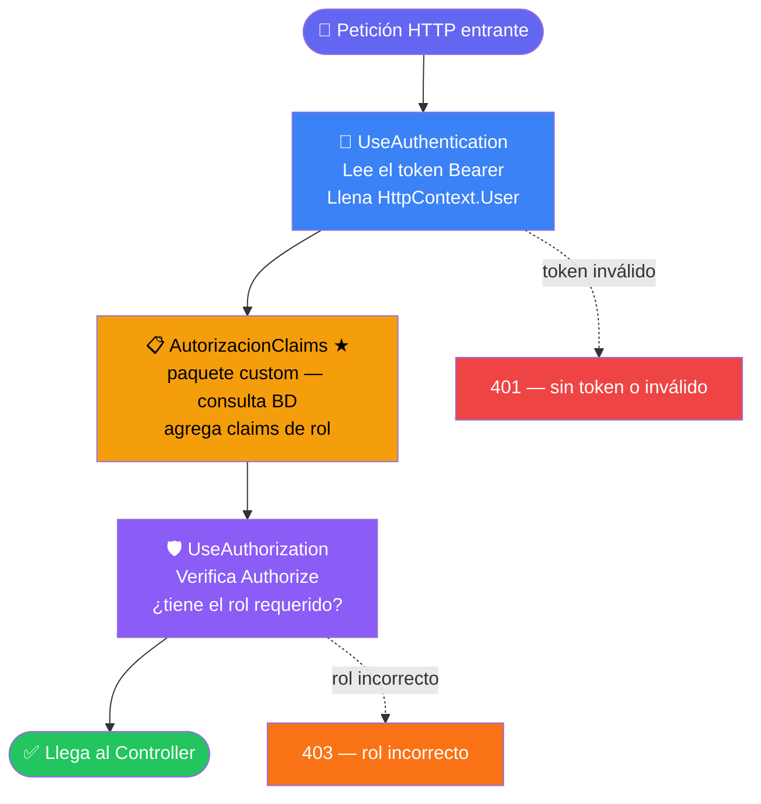

```
// ✅ CORRECTO
app.AutorizacionClaims();  // Segundo: necesita saber quién es el usuario
app.UseAuthorization();    // Tercero: verifica si puede acceder

// ❌ INCORRECTO — UseAuthorization no sabe a quién verificar
app.UseAuthorization();
app.AutorizacionClaims();
```

### 7.6 — Proteger los Controllers

**ANTES — `VehiculoController.cs`:**
```csharp
using Abstracciones.Interfaces.API;
using Abstracciones.Interfaces.Flujo;
using Abstracciones.Modelos;
using Microsoft.AspNetCore.Mvc;

namespace API.Controllers
{
    [Route("api/[controller]")]
    [ApiController]
    public class VehiculoController : ControllerBase, IVehiculoController
    {
        [HttpPost]
        public async Task<IActionResult> Agregar([FromBody] VehiculoRequest vehiculo) { ... }

        [HttpPut("{Id}")]
        public async Task<IActionResult> Editar([FromRoute] Guid Id, [FromBody] VehiculoRequest vehiculo) { ... }

        [HttpDelete("{Id}")]
        public async Task<IActionResult> Eliminar([FromRoute] Guid Id) { ... }

        [HttpGet]
        public async Task<IActionResult> Obtener() { ... }

        [HttpGet("{Id}")]
        public async Task<IActionResult> Obtener([FromRoute] Guid Id) { ... }
    }
}
```

**DESPUÉS:**
```csharp
using Abstracciones.Interfaces.API;
using Abstracciones.Interfaces.Flujo;
using Abstracciones.Modelos;
using Microsoft.AspNetCore.Authorization;  // ★ NUEVO using
using Microsoft.AspNetCore.Mvc;

namespace API.Controllers
{
    [Route("api/[controller]")]
    [ApiController]
    [Authorize]                              // ★ en la clase: requiere autenticación
    public class VehiculoController : ControllerBase, IVehiculoController
    {
        [HttpPost]
        [Authorize(Roles = "1")]             // ★ en cada método: requiere Rol = 1
        public async Task<IActionResult> Agregar([FromBody] VehiculoRequest vehiculo) { ... }

        [HttpPut("{Id}")]
        [Authorize(Roles = "1")]
        public async Task<IActionResult> Editar([FromRoute] Guid Id, [FromBody] VehiculoRequest vehiculo) { ... }

        [HttpDelete("{Id}")]
        [Authorize(Roles = "1")]
        public async Task<IActionResult> Eliminar([FromRoute] Guid Id) { ... }

        [HttpGet]
        [Authorize(Roles = "1")]
        public async Task<IActionResult> Obtener() { ... }

        [HttpGet("{Id}")]
        [Authorize(Roles = "1")]
        public async Task<IActionResult> Obtener([FromRoute] Guid Id) { ... }
    }
}
```

**ANTES — `MarcaController.cs`:**
```csharp
using Abstracciones.Interfaces.API;
using Abstracciones.Interfaces.Flujo;
using Abstracciones.Modelos;
using Microsoft.AspNetCore.Mvc;

namespace API.Controllers
{
    [Route("api/[controller]")]
    [ApiController]
    public class MarcaController : ControllerBase, IMarcaController
    {
        [HttpGet]
        public async Task<IActionResult> Obtener() { ... }
    }
}
```

**DESPUÉS:**
```csharp
using Abstracciones.Interfaces.API;
using Abstracciones.Interfaces.Flujo;
using Abstracciones.Modelos;
using Microsoft.AspNetCore.Authorization;  // ★
using Microsoft.AspNetCore.Mvc;

namespace API.Controllers
{
    [Route("api/[controller]")]
    [ApiController]
    [Authorize]                              // ★
    public class MarcaController : ControllerBase, IMarcaController
    {
        [HttpGet]
        [Authorize(Roles = "1")]             // ★
        public async Task<IActionResult> Obtener() { ... }
    }
}
```

> El número `"1"` es el Id del Rol en la BD de seguridad.
> `401` = sin token. `403` = token válido pero rol incorrecto.

---

---

# VIDEO 6 — WEB de Vehículos con Seguridad

---

## PARTE 8 — WEB Vehículo con seguridad implementada

### Resumen de cambios

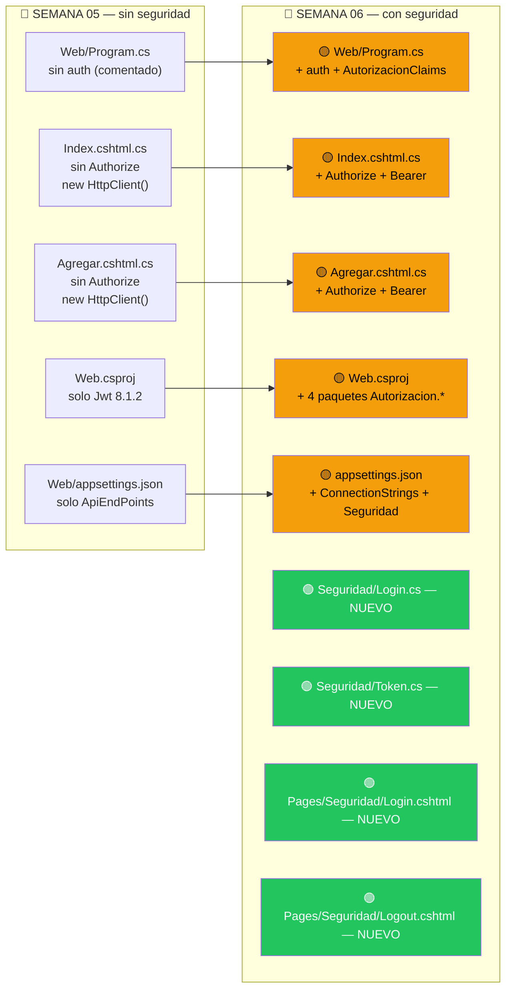

### 8.2 — `Web/Web.csproj`

**ANTES:**
```xml
<Project Sdk="Microsoft.NET.Sdk.Web">
  <PropertyGroup>
    <TargetFramework>net8.0</TargetFramework>
    <Nullable>enable</Nullable>
    <ImplicitUsings>enable</ImplicitUsings>
  </PropertyGroup>

  <ItemGroup>
    <PackageReference Include="System.IdentityModel.Tokens.Jwt" Version="8.1.2" />
  </ItemGroup>

  <ItemGroup>
    <ProjectReference Include="..\Abstracciones\Abstracciones.csproj" />
    <ProjectReference Include="..\Reglas\Reglas.csproj" />
  </ItemGroup>
</Project>
```

**DESPUÉS:**
```xml
<Project Sdk="Microsoft.NET.Sdk.Web">
  <PropertyGroup>
    <TargetFramework>net8.0</TargetFramework>
    <Nullable>enable</Nullable>
    <ImplicitUsings>enable</ImplicitUsings>
  </PropertyGroup>

  <ItemGroup>
    <PackageReference Include="System.IdentityModel.Tokens.Jwt"   Version="8.1.2" />
    <!-- ★ NUEVOS -->
    <PackageReference Include="Autorizacion.Abstracciones"         Version="2.0.6" />
    <PackageReference Include="Autorizacion.DA"                    Version="2.0.6" />
    <PackageReference Include="Autorizacion.Flujo"                 Version="2.0.6" />
    <PackageReference Include="Autorizacion.Middleware"            Version="2.0.6" />
  </ItemGroup>

  <ItemGroup>
    <ProjectReference Include="..\Abstracciones\Abstracciones.csproj" />
    <ProjectReference Include="..\Reglas\Reglas.csproj" />
  </ItemGroup>
</Project>
```

### 8.3 — Modelos de Seguridad (archivos nuevos)

**`Abstracciones/Modelos/Seguridad/Login.cs`:**
```csharp
// NUEVO: Abstracciones/Modelos/Seguridad/Login.cs
using System.ComponentModel.DataAnnotations;

namespace Abstracciones.Modelos.Seguridad
{
    public class Login
    {
        [Required(ErrorMessage = "El correo es requerido")]
        [EmailAddress(ErrorMessage = "Formato de correo inválido")]
        public string Correo { get; set; }

        [Required(ErrorMessage = "La contraseña es requerida")]
        [StringLength(100, MinimumLength = 8, ErrorMessage = "Mínimo 8 caracteres")]
        public string Contrasena { get; set; }
    }
}
```

**`Abstracciones/Modelos/Seguridad/Token.cs`:**
```csharp
// NUEVO: Abstracciones/Modelos/Seguridad/Token.cs
namespace Abstracciones.Modelos.Seguridad
{
    public class Token
    {
        public bool   ValidacionExitosa { get; set; }
        public string AccessToken       { get; set; }
    }
}
```

### 8.4 — Métodos de `Reglas/Autenticacion.cs` usados en el WEB

```csharp
// Reglas/Autenticacion.cs
using Abstracciones.Modelos;
using System.IdentityModel.Tokens.Jwt;
using System.Security.Claims;
using System.Security.Cryptography;
using System.Text;

namespace Reglas
{
    public static class Autenticacion
    {
        // Genera el hash SHA-256 de la contraseña como array de bytes
        public static byte[] GenerarHash(string contrasenia)
        {
            using (SHA256 shaHash = SHA256.Create())
            {
                byte[] bytes = shaHash.ComputeHash(Encoding.UTF8.GetBytes(contrasenia));
                return bytes;
            }
        }

        // Convierte el array de bytes a string hexadecimal (para enviar al API)
        public static string ObtenerHash(byte[] hash)
        {
            StringBuilder builder = new StringBuilder();
            for (int i = 0; i < hash.Length; i++)
            {
                builder.Append(hash[i].ToString("x2"));
            }
            return builder.ToString();
        }

        // Deserializa el JWT string en un objeto JwtSecurityToken con claims accesibles
        public static JwtSecurityToken? leerToken(string token)
        {
            var handler = new JwtSecurityTokenHandler();
            var jsonToken = handler.ReadToken(token) as JwtSecurityToken;
            return jsonToken;
        }

        // Extrae Name, NameIdentifier, Email del token y agrega el AccessToken como claim
        public static List<Claim> GenerarClaims(JwtSecurityToken? jwtToken, string accessToken)
        {
            var claims = new List<Claim>();
            claims.Add(new Claim(ClaimTypes.Name,
                jwtToken.Claims.First(c => c.Type == ClaimTypes.Name).Value));
            claims.Add(new Claim(ClaimTypes.NameIdentifier,
                jwtToken.Claims.First(c => c.Type == ClaimTypes.NameIdentifier).Value));
            claims.Add(new Claim(ClaimTypes.Email,
                jwtToken.Claims.First(c => c.Type == ClaimTypes.Email).Value));
            claims.Add(new Claim("Token", accessToken));
            return claims;
        }
    }
}
```

| Método | Uso en el WEB |
|--------|--------------|
| `GenerarHash` + `ObtenerHash` | Hashear contraseña antes de enviar al API de Seguridad |
| `leerToken` | Deserializar el JWT recibido tras el login |
| `GenerarClaims` | Crear los claims para la cookie de autenticación |

### 8.5 — `Web/appsettings.json`

**ANTES:**
```json
{
  "Logging": {
    "LogLevel": { "Default": "Information", "Microsoft.AspNetCore": "Warning" }
  },
  "AllowedHosts": "*",
  "ApiEndPoints": {
    "UrlBase": "https://localhost:7251/API/",
    "Metodos": [
      { "Nombre": "ObtenerVehiculos", "Valor": "api/vehiculo" },
      { "Nombre": "ObtenerMarcas",    "Valor": "api/marca" },
      { "Nombre": "ObtenerVehiculo",  "Valor": "api/vehiculo/{0}" },
      { "Nombre": "ObtenerModelos",   "Valor": "api/modelo/{0}" },
      { "Nombre": "EditarVehiculo",   "Valor": "api/vehiculo/{0}" },
      { "Nombre": "AgregarVehiculo",  "Valor": "api/vehiculo" },
      { "Nombre": "EliminarVehiculo", "Valor": "api/vehiculo/{0}" }
    ]
  }
}
```

**DESPUÉS:**
```json
{
  "Logging": {
    "LogLevel": { "Default": "Information", "Microsoft.AspNetCore": "Warning" }
  },
  "AllowedHosts": "*",
  "ConnectionStrings": {
    "BDSeguridad": "Data Source=tcp:sc701.database.windows.net;Initial Catalog=seguridad;User ID=administrador;Password=TUPASSWORD;Encrypt=True"
  },
  "ApiEndPoints": {
    "UrlBase": "https://localhost:7251/API/",
    "Metodos": [
      { "Nombre": "ObtenerVehiculos", "Valor": "api/vehiculo" },
      { "Nombre": "ObtenerMarcas",    "Valor": "api/marca" },
      { "Nombre": "ObtenerVehiculo",  "Valor": "api/vehiculo/{0}" },
      { "Nombre": "ObtenerModelos",   "Valor": "api/modelo/{0}" },
      { "Nombre": "EditarVehiculo",   "Valor": "api/vehiculo/{0}" },
      { "Nombre": "AgregarVehiculo",  "Valor": "api/vehiculo" },
      { "Nombre": "EliminarVehiculo", "Valor": "api/vehiculo/{0}" }
    ]
  },
  "ApiEndPointsSeguridad": {
    "UrlBase": "https://seguridad-api-sc701.azurewebsites.net/",
    "Metodos": [
      { "Nombre": "Login", "Valor": "api/autenticacion/login" }
    ]
  }
}
```

> En desarrollo local cambiar `UrlBase` de `ApiEndPointsSeguridad` a `https://localhost:7253/`

### 8.6 — `Web/Program.cs`

**ANTES (usings comentados):**
```csharp
using Abstracciones.Interfaces.Reglas;
//using Autorizacion.Abstracciones.DA;
//using Autorizacion.Abstracciones.Flujo;
//using Autorizacion.DA;
//using Autorizacion.DA.Repositorios;
//using Autorizacion.Flujo;
//using Autorizacion.Middleware;
using Microsoft.AspNetCore.Authentication.Cookies;
using Reglas;

var builder = WebApplication.CreateBuilder(args);

builder.Services.AddRazorPages();
builder.Services.AddScoped<IConfiguracion, Configuracion>();

var app = builder.Build();

if (!app.Environment.IsDevelopment())
{
    app.UseExceptionHandler("/Error");
    app.UseHsts();
}

app.UseHttpsRedirection();
app.UseStaticFiles();
app.UseRouting();
app.MapRazorPages();
app.Run();
```

**DESPUÉS (★ = líneas nuevas o descomentadas):**
```csharp
using Abstracciones.Interfaces.Reglas;
using Autorizacion.Abstracciones.DA;        // ★
using Autorizacion.Abstracciones.Flujo;     // ★
using Autorizacion.DA;                      // ★
using Autorizacion.DA.Repositorios;        // ★
using Autorizacion.Flujo;                  // ★
using Autorizacion.Middleware;             // ★
using Microsoft.AspNetCore.Authentication.Cookies;
using Reglas;

var builder = WebApplication.CreateBuilder(args);

builder.Services.AddRazorPages();
builder.Services.AddScoped<IConfiguracion, Configuracion>();

// ★ Autenticación con cookie — guarda el JWT dentro de una cookie cifrada
builder.Services.AddAuthentication(CookieAuthenticationDefaults.AuthenticationScheme)
    .AddCookie(options =>
    {
        options.LoginPath        = "/Seguridad/Login";
        options.LogoutPath       = "/Seguridad/Logout";
        options.AccessDeniedPath = "/Seguridad/Acceso";
        options.ExpireTimeSpan   = TimeSpan.FromMinutes(120);
    });

// ★ Servicios del paquete NuGet de autorización (para AutorizacionClaims)
builder.Services.AddTransient<IAutorizacionFlujo, AutorizacionFlujo>();
builder.Services.AddTransient<ISeguridadDA, SeguridadDA>();
builder.Services.AddTransient<IRepositorioDapper, RepositorioDapper>();

var app = builder.Build();

if (!app.Environment.IsDevelopment())
{
    app.UseExceptionHandler("/Error");
    app.UseHsts();
}

app.UseHttpsRedirection();
app.UseStaticFiles();
app.UseRouting();

app.UseAuthentication();    // ★ lee la cookie → llena HttpContext.User
app.AutorizacionClaims();   // ★ agrega claims de rol desde BD de seguridad
app.UseAuthorization();     // ★ verifica [Authorize]

app.MapRazorPages();
app.Run();
```

### 8.7 — Páginas de Seguridad

> Las páginas viven en `Pages/Cuenta/` — namespace: `Web.Pages.Cuenta`

#### `Pages/Cuenta/Login.cshtml`:
```html
@page
@model Web.Pages.Cuenta.LoginModel
@{ }
<header class="subhead">
    <div class="container">
        <div class="masthead-subheading">SC-701: Programación Web Avanzada</div>
        <div class="masthead-heading text-uppercase">Ejercicio persona</div>
    </div>
</header>


<section class="page-section bg-light" id="principal">
    <div class="container">
        <div class="col-xl-5 col-lg-6 col-md-8 col-sm-10 mx-auto bg-white p-2 p-md-5 rounded shadow">
            <div class="text-center">
                <h2 class="section-heading text-uppercase">Iniciar sesión</h2>
                <h3 class="section-subheading text-muted">
                    Lorem ipsum dolor sit amet consectetur.
                </h3>
            </div>
            <form method="post">
                <div class="input-group mb-3">
                    <span class="input-group-text">
                        <i class="bi bi-envelope-at"></i>
                    </span>
                    <input type="email"
                           placeholder="Correo electrónico"
                           asp-for="loginInfo.CorreoElectronico"
                           class="form-control form-control-lg" />
                </div>
                <div class="input-group mb-3">
                    <span asp-validation-for="loginInfo.CorreoElectronico" class="text-danger"></span>
                </div>

                <div class="input-group mb-3">
                    <span class="input-group-text">
                        <i class="bi bi-key"></i>
                    </span>
                    <input type="password"
                           placeholder="Contraseña"
                           asp-for="loginInfo.Password"
                           class="form-control form-control-lg" />
                </div>
                <div class="input-group mb-3">
                    <span asp-validation-for="loginInfo.Password" class="text-danger"></span>
                </div>
                  @if (Model.token is not null && Model.token.ValidacionExitosa == false)
                    {
                    <div class="alert alert-warning" role="alert">
                      Credenciales incorrectas!
                    </div>
                    } 
                <div class="d-grid gap-2">
                    <button class="btn btn-primary" type="submit">Iniciar Sesión</button>
                </div>
                <input type="hidden" asp-for="loginInfo.CorreoElectronico" />
            </form>
            <div class="row">
                <div class="col-12">
                    <hr class="mt-5 mb-4 border-secondary-subtle" />
                    <div class="d-flex gap-2 gap-md-4 flex-column flex-md-row justify-content-md-center">
                        <a href="./registro" class="link-secondary text-decoration-none">Registrarse</a>
                        <a href="#!" class="link-secondary text-decoration-none">Olvidó su contraseña</a>
                    </div>
                </div>
            </div>
        </div>
    </div>
</section>
```

#### `Pages/Cuenta/Login.cshtml.cs`:
```csharp
// Login.cshtml.cs
using Abstracciones.Interfaces.Reglas;
using Abstracciones.Modelos;
using Abstracciones.Modelos.Seguridad;
using Microsoft.AspNetCore.Authentication;
using Microsoft.AspNetCore.Authentication.Cookies;
using Microsoft.AspNetCore.Mvc;
using Microsoft.AspNetCore.Mvc.RazorPages;
using Reglas;
using System.IdentityModel.Tokens.Jwt;
using System.Security.Claims;
using System.Text.Json;

namespace Web.Pages.Cuenta
{
    public class LoginModel : PageModel
    {
        [BindProperty]
        public LoginRequest loginInfo { get; set; } = default!;
        [BindProperty]
        public Token token { get; set; } = default!;
        private IConfiguracion _configuracion;

        public LoginModel(IConfiguracion configuracion)
        {
            _configuracion = configuracion;
        }

        public async Task<IActionResult> OnPost()
        {
            if (ModelState.IsValid)
            {
                // 1. Hashear la contraseña (byte[] → string hexadecimal)
                var Hash = Autenticacion.GenerarHash(loginInfo.Password);
                loginInfo.PasswordHash = Autenticacion.ObtenerHash(Hash);

                // 2. NombreUsuario derivado del correo
                loginInfo.NombreUsuario = loginInfo.CorreoElectronico.Split("@")[0];

                // 3. Llamar al API de Seguridad vía ObtenerMetodo
                string endpoint = _configuracion.ObtenerMetodo("ApiEndPointsSeguridad", "Login");
                var client = new HttpClient();
                var respuesta = await client.PostAsJsonAsync<LoginBase>(endpoint,
                    new LoginBase {
                        NombreUsuario     = loginInfo.NombreUsuario,
                        CorreoElectronico = loginInfo.CorreoElectronico,
                        PasswordHash      = loginInfo.PasswordHash
                    });
                respuesta.EnsureSuccessStatusCode();

                var opciones = new JsonSerializerOptions { PropertyNameCaseInsensitive = true };
                token = JsonSerializer.Deserialize<Token>(
                    respuesta.Content.ReadAsStringAsync().Result, opciones);

                if (token.ValidacionExitosa)
                {
                    // 4. Leer JWT y generar claims para la cookie
                    JwtSecurityToken? jwtToken = Autenticacion.leerToken(token.AccessToken);
                    var claims = Autenticacion.GenerarClaims(jwtToken, token.AccessToken);
                    await establecerAutenticacion(claims);

                    // 5. Redirigir a ReturnUrl o al índice
                    var urlredirigir = $"{HttpContext.Request.Query["ReturnUrl"]}";
                    if (string.IsNullOrEmpty(urlredirigir))
                        return Redirect("/");
                    return Redirect(urlredirigir);
                }
            }
            return Page();
        }

        // Helper: crea la ClaimsIdentity y firma la cookie
        private async Task establecerAutenticacion(List<Claim> claims)
        {
            var identity  = new ClaimsIdentity(claims, CookieAuthenticationDefaults.AuthenticationScheme);
            var principal = new ClaimsPrincipal(identity);
            await HttpContext.SignInAsync(principal);
        }
    }
}
```

#### `Pages/Cuenta/Logout.cshtml.cs`:
```csharp
// Logout.cshtml.cs
using Microsoft.AspNetCore.Authentication;
using Microsoft.AspNetCore.Mvc;
using Microsoft.AspNetCore.Mvc.RazorPages;

namespace Web.Pages.Cuenta
{
    public class LogoutModel : PageModel
    {
        public async Task<IActionResult> OnGet()
        {
            await HttpContext.SignOutAsync();   // sin esquema explícito
            return RedirectToPage("/Index");
        }
    }
}
```

#### `Pages/Cuenta/Registro.cshtml.cs`:
```csharp
// Registro.cshtml.cs
using Abstracciones.Interfaces.Reglas;
using Abstracciones.Modelos.Seguridad;
using Microsoft.AspNetCore.Mvc;
using Microsoft.AspNetCore.Mvc.RazorPages;
using Reglas;

namespace Web.Pages.Cuenta
{
    public class RegistroModel : PageModel
    {
        [BindProperty]
        public Usuario usuario { get; set; } = default!;
        private IConfiguracion _configuracion;

        public RegistroModel(IConfiguracion configuracion)
        {
            _configuracion = configuracion;
        }

        public async Task<IActionResult> OnPost()
        {
            if (!ModelState.IsValid) return Page();

            var hash = Autenticacion.GenerarHash(usuario.Password);
            usuario.PasswordHash = Autenticacion.ObtenerHash(hash);

            string endpoint = _configuracion.ObtenerMetodo("ApiEndPointsSeguridad", "Registro");
            var cliente = new HttpClient();
            var respuesta = await cliente.PostAsJsonAsync<UsuarioBase>(endpoint, usuario);
            respuesta.EnsureSuccessStatusCode();
            return RedirectToPage("../index");
        }
    }
}
```

#### `Pages/Cuenta/Registro.cshtml`:
```html
@page
@model Web.Pages.Cuenta.RegistroModel
@{
}
<header class="subhead">
    <div class="container">
        <div class="masthead-subheading">SC-701: Programación Web Avanzada</div>
        <div class="masthead-heading text-uppercase">Ejercicio persona</div>
    </div>
</header>

<section class="page-section bg-light" id="principal">
    <div class="container">
        <div class="col-xl-5 col-lg-6 col-md-8 col-sm-10 mx-auto bg-white p-2 p-md-5 rounded shadow">
            <div class="text-center">
                <h2 class="section-heading text-uppercase">Registrarse</h2>
                <h3 class="section-subheading text-muted">
                    Lorem ipsum dolor sit amet consectetur.
                </h3>
            </div>
            <form method="post">
                <div class="input-group mb-3">
                    <span class="input-group-text">
                        <i class=" bi bi-person-fill"></i>
                    </span>
                    <input type="text" asp-for="usuario.NombreUsuario" class="form-control"
                           placeholder="Nombre de usuario" />
                </div>
                <div class="input-group mb-3">
                    <span asp-validation-for="usuario.NombreUsuario" class="text-danger"></span>
                </div>
                <div class="input-group mb-3">
                    <span class="input-group-text">
                        <i class=" bi bi-envelope-at-fill"></i>
                    </span>
                    <input type="email" asp-for="usuario.CorreoElectronico" class="form-control"
                           placeholder="Correo electrónico" />
                </div>
                <div class="input-group mb-3">
                    <span asp-validation-for="usuario.CorreoElectronico" class="text-danger"></span>
                </div>
                <div class="input-group mb-3">
                    <span class="input-group-text">
                        <i class=" bi bi-key-fill"></i>
                    </span>
                    <input type="password" asp-for="usuario.Password" class="form-control" />
                </div>
                <div class="input-group mb-3">
                    <span asp-validation-for="usuario.Password" class="text-danger"></span>
                </div>
                <div class="input-group mb-3">
                    <span class="input-group-text">
                        <i class=" bi bi-key-fill"></i>
                    </span>
                    <input type="password" asp-for="usuario.ConfirmarPassword" class="form-control" />
                </div>
                <div class="input-group mb-3">
                    <span asp-validation-for="usuario.ConfirmarPassword" class="text-danger"></span>
                </div>
                <div class="form-check d-flex justify-content-center mb-5">
                    <input class="form-check-input me-2" type="checkbox" value="" id="aceptar" />
                    He leído y acepto <a href="#!">los términos y condiciones de uso</a>
                    </label>
                </div>
                <div class="d-grid gap-2">
                    <button type="submit" class="btn btn-primary btn-lg">Registrarse</button>
                </div>
            </form>
        </div>
    </div>
</section>
```
```csharp
// AccesoDenegado.cshtml.cs
using Microsoft.AspNetCore.Mvc.RazorPages;

namespace Web.Pages.Cuenta
{
    public class AccesoDenegadoModel : PageModel
    {
        public void OnGet() { }
    }
}
```

#### `Pages/Cuenta/AccesoDenegado.cshtml`:
```html
@page
@model Web.Pages.Cuenta.AccesoDenegadoModel
@{
}
<header class="subhead">
    <div class="container">
        <div class="masthead-subheading">SC-701: Programación Web Avanzada</div>
        <div class="masthead-heading text-uppercase">Ejercicio persona</div>
    </div>
</header>
<section class="page-section bg-light">
    <div class="text-center">
        <h1 class="section-heading text-uppercase">403 </h1>
        <h2 class="section-subheading text-muted">Acceso denegado</h2>
    </div>
    <div class="container py-5 h-100">
        
    </div>
</section>
```

#### Flujo: cookie → API

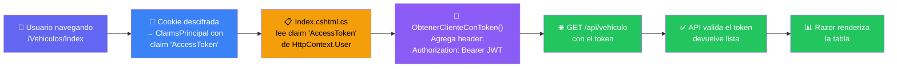

#### `Pages/Vehiculos/Index.cshtml.cs`

**ANTES:**
```csharp
// Sin [Authorize], sin Bearer en el HttpClient
public class IndexModel : PageModel
{
    public async Task OnGet()
    {
        using var cliente = new HttpClient();   // ← sin token
        cliente.BaseAddress = new Uri(urlBase);
        var respuesta = await cliente.GetAsync(metodo);
        // ...
    }
}
```

**DESPUÉS:**
```csharp
using Microsoft.AspNetCore.Authorization;  // ★
using Reglas;                               // ★

[Authorize]                                // ★ requiere login
public class IndexModel : PageModel
{
    public async Task OnGet()
    {
        using var cliente = ObtenerClienteConToken();  // ★
        cliente.BaseAddress = new Uri(urlBase);
        var respuesta = await cliente.GetAsync(metodo);
        // ... resto igual
    }

    // ★ Helper — extrae el JWT de los claims y configura el HttpClient
    private HttpClient ObtenerClienteConToken()
    {
        var tokenClaim = HttpContext.User.Claims
            .FirstOrDefault(c => c.Type == "AccessToken");
        var cliente = new HttpClient();
        if (tokenClaim != null)
            cliente.DefaultRequestHeaders.Authorization =
                new System.Net.Http.Headers.AuthenticationHeaderValue(
                    "Bearer", tokenClaim.Value);
        return cliente;
    }
}
```

#### `Pages/Vehiculos/Agregar.cshtml.cs`

**DESPUÉS (mismo patrón):**
```csharp
[Authorize]                                // ★
public class AgregarModel : PageModel
{
    public async Task<IActionResult> OnPostAsync()
    {
        using var cliente = ObtenerClienteConToken();  // ★ reemplaza new HttpClient()
        // ... resto igual
    }

    public async Task<JsonResult> OnGetObtenerModelos(Guid marcaId)
    {
        using var cliente = ObtenerClienteConToken();  // ★
        // ... resto igual
    }

    private async Task ObtenerMarcasAsync()
    {
        using var cliente = ObtenerClienteConToken();  // ★
        // ... resto igual
    }

    // ★ mismo helper que en Index
    private HttpClient ObtenerClienteConToken()
    {
        var tokenClaim = HttpContext.User.Claims
            .FirstOrDefault(c => c.Type == "AccessToken");
        var cliente = new HttpClient();
        if (tokenClaim != null)
            cliente.DefaultRequestHeaders.Authorization =
                new System.Net.Http.Headers.AuthenticationHeaderValue(
                    "Bearer", tokenClaim.Value);
        return cliente;
    }
}
```

> 💡 El método `ObtenerClienteConToken()` es idéntico en todas las páginas. Se puede extraer
> a una clase base `AuthPageModel : PageModel` para eliminar la repetición.

---

## PARTE 9 — Prueba de integración

### Secuencia de prueba

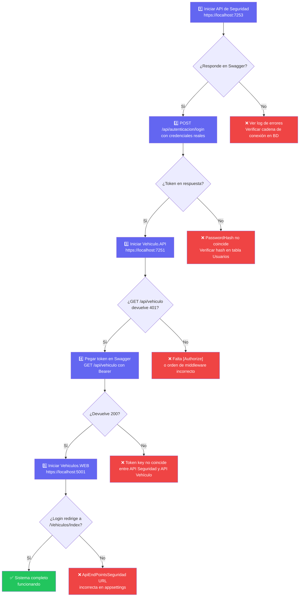

### Comandos de verificación

```bash
# Arrancar los 3 proyectos
dotnet run --project Ejemplos/Seguridad/Seguridad.API/API
dotnet run --project "Semana 05-API y WEB/Vehiculo.API/API"
dotnet run --project "Semana 05-API y WEB/Vehiculos.WEB/Web"

# Test rápido del API de Seguridad
curl -X POST https://localhost:7253/api/autenticacion/login \
     -H "Content-Type: application/json" \
     -d '{"correo":"usuario@test.com","contrasena":"HASH_AQUI"}'
```

---

## PARTE 10 — Errores frecuentes y resumen

### Errores más comunes

| Error | Causa más probable | Solución |
|-------|--------------------|---------|
| `401 Unauthorized` en Swagger | No se envió el token | Clic en 🔓 Authorize → pegar el `AccessToken` |
| `403 Forbidden` | Token válido pero rol incorrecto | Verificar `SELECT * FROM UsuariosPerfiles` y `SELECT * FROM Perfiles` |
| Redirige siempre al Login | Falta `UseAuthentication()` o está después de `UseAuthorization()` | Revisar el orden en `Program.cs` del WEB |
| `NullReferenceException` en claim `AccessToken` | La cookie no tiene el claim | Verificar que `GenerarClaims()` agrega `new Claim("AccessToken", token)` |
| Paquete NuGet no encontrado | Feed `github` no registrado en la máquina | Ejecutar `dotnet nuget add source` con las credenciales (ver sección 4.4) |
| JWT inválido en el API Vehículo | La `Token:key` no coincide entre los dos APIs | Usar la misma `key` exacta en `appsettings.json` de ambos APIs |
| `500` al publicar en Azure | Variable de entorno no configurada | Revisar `Configuration → Application settings` en el App Service |

### Resumen del sistema

| Concepto | Qué hace | Dónde vive |
|----------|---------|-----------|
| **Hash SHA256** | Protege la contraseña — nunca texto claro | `Reglas/Autenticacion.cs` |
| **JWT** | Token firmado que identifica al usuario y sus roles | Emitido por API Seguridad |
| **Paquete NuGet** | Middleware reutilizable — consulta roles en BD | GitHub Packages |
| **API Seguridad** | Valida credenciales → emite JWT | Azure App Service |
| **`[Authorize(Roles)]`** | Protege endpoints del API Vehículo | Controllers |
| **Cookie Auth** | El WEB guarda el JWT en cookie cifrada | `Program.cs` del WEB |
| **`ObtenerClienteConToken()`** | Lee el JWT de la cookie y lo envía al API | Pages Razor |

---

## Arquitectura completa del sistema

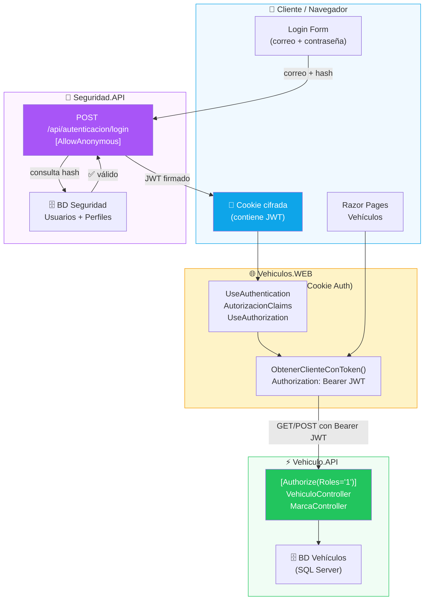

---

*SC701 — Semana 06*
